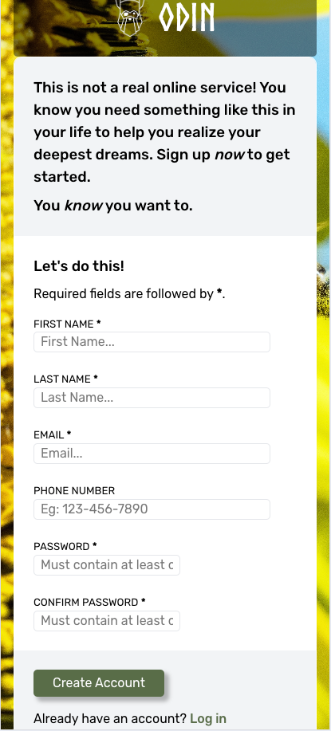
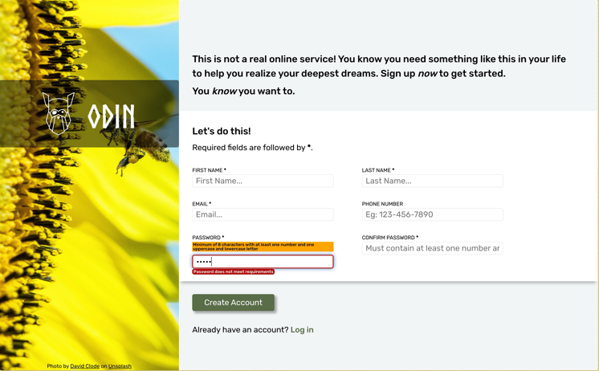

# sign-up-form
create a sign-up form from a mock-up

## Description
This is a mobile friendly project to build a sing-up form from a mock-up. It has a large background image with a bee and sunflower. The sign-up form has input fields for name, email, phone number, and password. When the input fields are selected there is a visual feedback with blue border and box-shadow. For password fields, when user selects the input a message is displayed with password requirements to create a secure password. And if the password does not meet the requirements, an error message is displayed with a red border around the input. Both passwords are validated separately based on the pattern attribute. There is a submit button at the bottom of the form and below that a link to log-in page if the user already has an account.

## Screenshots

## Credits
- Background image "Bee in front of Sunflower" by [David Clode](https://unsplash.com/@davidclode) on [Unsplash](https://unsplash.com/photos/bee-in-fornt-of-sunflower-swtg-ahmGzY)
- Odin logo image provided by [The Odin Project](https://cdn.statically.io/gh/TheOdinProject/curriculum/5f37d43908ef92499e95a9b90fc3cc291a95014c/html_css/project-sign-up-form/odin-lined.png)
